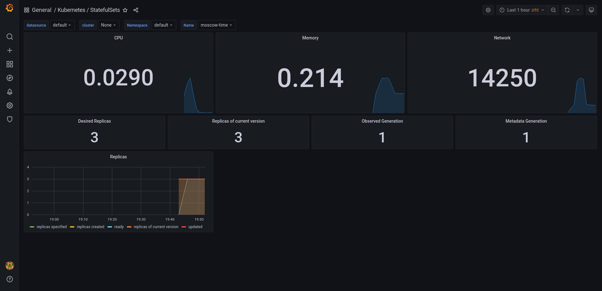
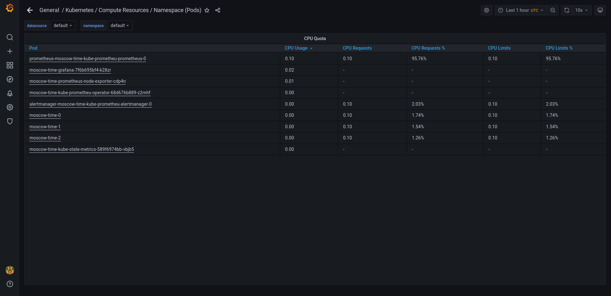
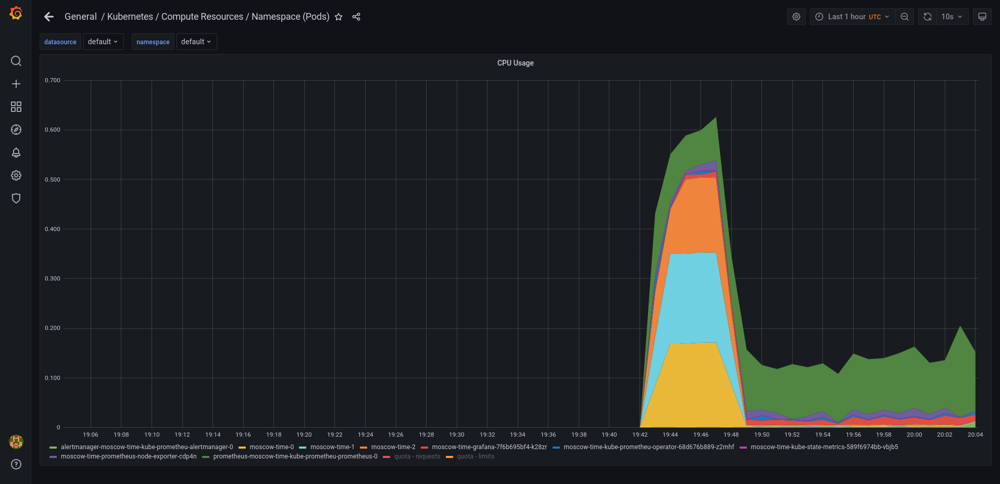
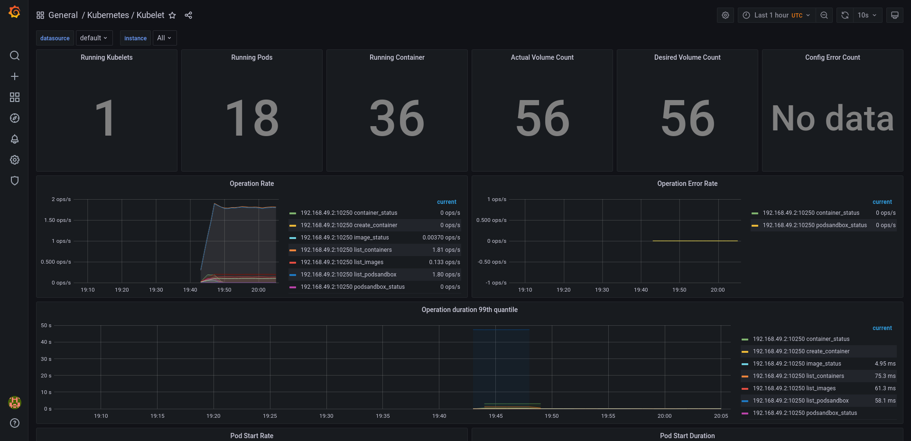
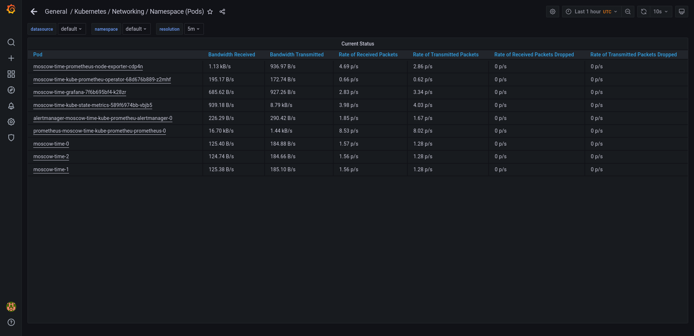
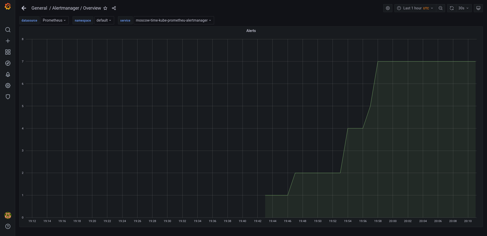

The Prometheus Operator: Prometheus in Kubernetes. Comfigures and manages Prometheus in Kubernetes.

Highly available Prometheus: Collects data and metrics from services

Highly available Alertmanager: Manages alert messages sent by client services.

Prometheus node-exporter: OS related metrics from nodes in Kubernetes are collected. 

Prometheus Adapter for Kubernetes Metrics APIs: Gathers metrics collected by Prometheus and exposes them with API

kube-state-metrics: gathers metrics from Kubernetes API server about components such as deployments, nodes and pods.

Grafana: Graphical representations for data collected by Prometheus


```bash
~/.../k8s/moscow-time >>> kubectl get po,sts,svc,pvc,cm                                                                                                                                                ±[●●][main]
NAME                                                         READY   STATUS    RESTARTS        AGE
pod/alertmanager-moscow-time-kube-prometheu-alertmanager-0   2/2     Running   0               10m
pod/moscow-time-0                                            1/1     Running   3 (7m11s ago)   11m
pod/moscow-time-1                                            1/1     Running   3 (7m11s ago)   11m
pod/moscow-time-2                                            1/1     Running   4 (6m51s ago)   11m
pod/moscow-time-grafana-7f6b695bf4-k28zr                     2/2     Running   0               11m
pod/moscow-time-kube-prometheu-operator-68d676b889-z2mhf     1/1     Running   0               11m
pod/moscow-time-kube-state-metrics-589f6974bb-vbjb5          1/1     Running   0               11m
pod/moscow-time-prometheus-node-exporter-cdp4n               1/1     Running   0               11m
pod/prometheus-moscow-time-kube-prometheu-prometheus-0       2/2     Running   0               10m

NAME                                                                    READY   AGE
statefulset.apps/alertmanager-moscow-time-kube-prometheu-alertmanager   1/1     10m
statefulset.apps/moscow-time                                            3/3     11m
statefulset.apps/prometheus-moscow-time-kube-prometheu-prometheus       1/1     10m

NAME                                              TYPE           CLUSTER-IP       EXTERNAL-IP   PORT(S)                      AGE
service/alertmanager-operated                     ClusterIP      None             <none>        9093/TCP,9094/TCP,9094/UDP   10m
service/kubernetes                                ClusterIP      10.96.0.1        <none>        443/TCP                      21d
service/moscow-time                               LoadBalancer   10.103.155.131   <pending>     5000:32565/TCP               11m
service/moscow-time-grafana                       ClusterIP      10.108.30.212    <none>        80/TCP                       11m
service/moscow-time-kube-prometheu-alertmanager   ClusterIP      10.109.46.171    <none>        9093/TCP                     11m
service/moscow-time-kube-prometheu-operator       ClusterIP      10.103.176.36    <none>        443/TCP                      11m
service/moscow-time-kube-prometheu-prometheus     ClusterIP      10.108.226.102   <none>        9090/TCP                     11m
service/moscow-time-kube-state-metrics            ClusterIP      10.107.59.113    <none>        8080/TCP                     11m
service/moscow-time-prometheus-node-exporter      ClusterIP      10.99.141.222    <none>        9100/TCP                     11m
service/prometheus-operated                       ClusterIP      None             <none>        9090/TCP                     10m

NAME                                         STATUS   VOLUME                                     CAPACITY   ACCESS MODES   STORAGECLASS   AGE
persistentvolumeclaim/visits-moscow-time-0   Bound    pvc-45fdcfcf-7720-4274-9a32-1bd4c5f768a4   256M       RWO            standard       7d
persistentvolumeclaim/visits-moscow-time-1   Bound    pvc-8dfebcad-81c4-41c6-a489-bb628f7be3a0   256M       RWO            standard       7d
persistentvolumeclaim/visits-moscow-time-2   Bound    pvc-45577728-5b65-44b8-8c17-b28a601307c3   256M       RWO            standard       7d

NAME                                                                     DATA   AGE
configmap/kube-root-ca.crt                                               1      21d
configmap/moscow-time-grafana                                            1      11m
configmap/moscow-time-grafana-config-dashboards                          1      11m
configmap/moscow-time-grafana-test                                       1      11m
configmap/moscow-time-kube-prometheu-alertmanager-overview               1      11m
configmap/moscow-time-kube-prometheu-apiserver                           1      11m
configmap/moscow-time-kube-prometheu-cluster-total                       1      11m
configmap/moscow-time-kube-prometheu-controller-manager                  1      11m
configmap/moscow-time-kube-prometheu-etcd                                1      11m
configmap/moscow-time-kube-prometheu-grafana-datasource                  1      11m
configmap/moscow-time-kube-prometheu-k8s-coredns                         1      11m
configmap/moscow-time-kube-prometheu-k8s-resources-cluster               1      11m
configmap/moscow-time-kube-prometheu-k8s-resources-namespace             1      11m
configmap/moscow-time-kube-prometheu-k8s-resources-node                  1      11m
configmap/moscow-time-kube-prometheu-k8s-resources-pod                   1      11m
configmap/moscow-time-kube-prometheu-k8s-resources-workload              1      11m
configmap/moscow-time-kube-prometheu-k8s-resources-workloads-namespace   1      11m
configmap/moscow-time-kube-prometheu-kubelet                             1      11m
configmap/moscow-time-kube-prometheu-namespace-by-pod                    1      11m
configmap/moscow-time-kube-prometheu-namespace-by-workload               1      11m
configmap/moscow-time-kube-prometheu-node-cluster-rsrc-use               1      11m
configmap/moscow-time-kube-prometheu-node-rsrc-use                       1      11m
configmap/moscow-time-kube-prometheu-nodes                               1      11m
configmap/moscow-time-kube-prometheu-persistentvolumesusage              1      11m
configmap/moscow-time-kube-prometheu-pod-total                           1      11m
configmap/moscow-time-kube-prometheu-prometheus                          1      11m
configmap/moscow-time-kube-prometheu-proxy                               1      11m
configmap/moscow-time-kube-prometheu-scheduler                           1      11m
configmap/moscow-time-kube-prometheu-statefulset                         1      11m
configmap/moscow-time-kube-prometheu-workload-total                      1      11m
configmap/prometheus-moscow-time-kube-prometheu-prometheus-rulefiles-0   28     10m
```


1) Check how much CPU and Memory your StatefulSet is consuming

CPU: ~3%

Memory: 0.216GB

2) Check which Pod is using CPU more than others and which is less in the default namespace.

prometheus-moscow-time-kube-prometheu-prometheus consumes more that the others

alertmanager-moscow-time-kube-prometheu-alertmanager consumes less than the others



3) Check how much memory is used on your node, in % and mb.



4) Check how many pods and containers actually ran by the Kubelet service.



5) Check which Pod is using network more than others and which is less in the default namespace.

less: moscow-time-0

more: prometheus-moscow-time-kube-prometheu-prometheus-0



6) Check how many alerts you have.



```bash
~/.../lab_1_2/k8s >>> kubectl exec pod/moscow-time-0 -- cat /wget/test.html                                                                                                                            ±[●●][main]
Defaulted container "moscow-time" out of: moscow-time, wget (init)
<html><head></head><body><header>
<title>http://info.cern.ch</title>
</header>

<h1>http://info.cern.ch - home of the first website</h1>
<p>From here you can:</p>
<ul>
<li><a href="http://info.cern.ch/hypertext/WWW/TheProject.html">Browse the first website</a></li>
<li><a href="http://line-mode.cern.ch/www/hypertext/WWW/TheProject.html">Browse the first website using the line-mode browser simulator</a></li>
<li><a href="http://home.web.cern.ch/topics/birth-web">Learn about the birth of the web</a></li>
<li><a href="http://home.web.cern.ch/about">Learn about CERN, the physics laboratory where the web was born</a></li>
</ul>
</body></html>

```